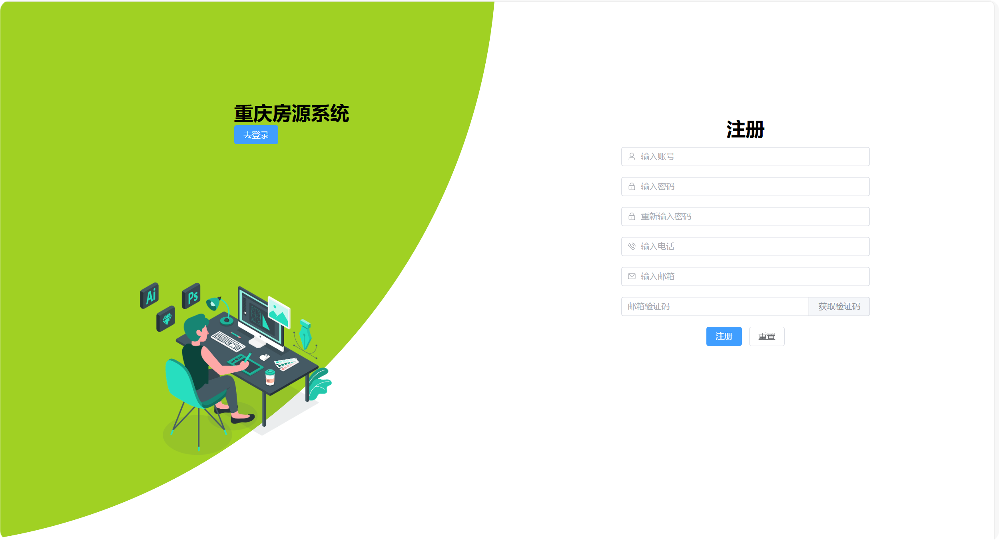
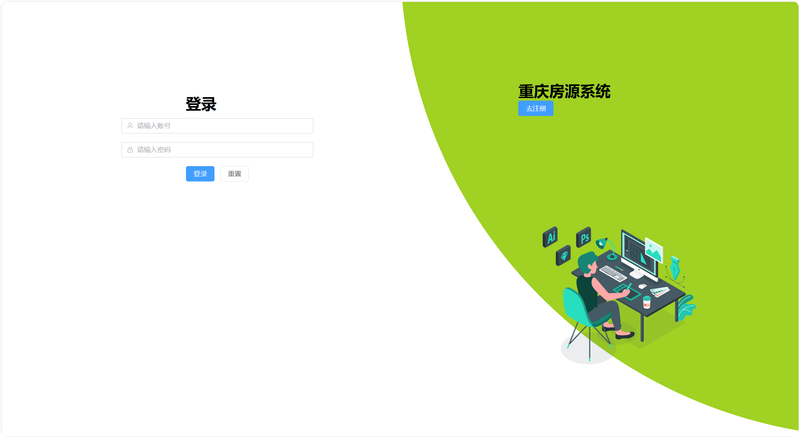
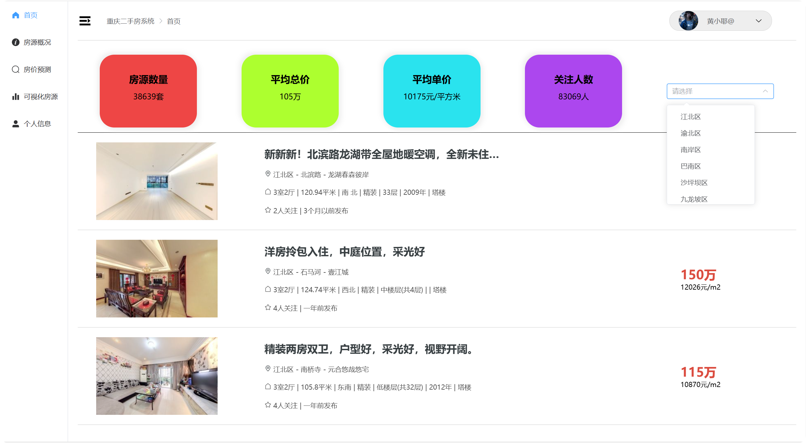
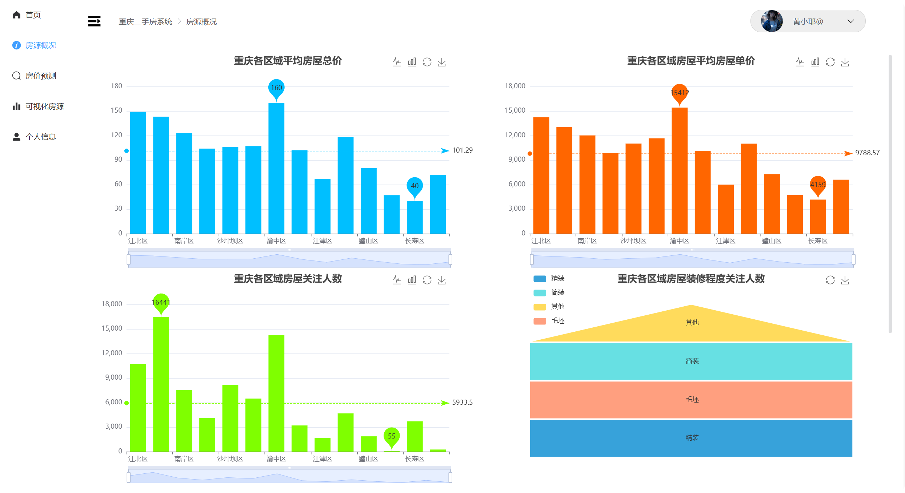
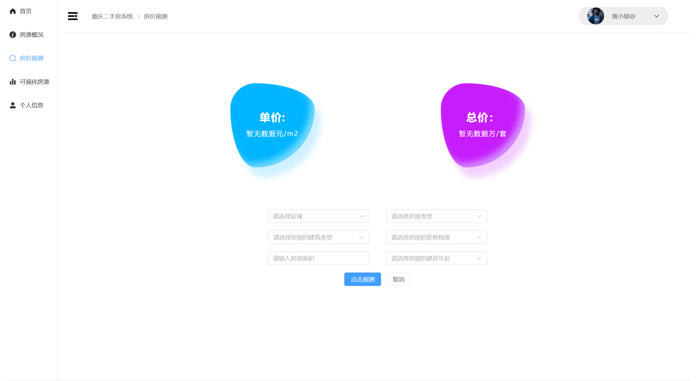
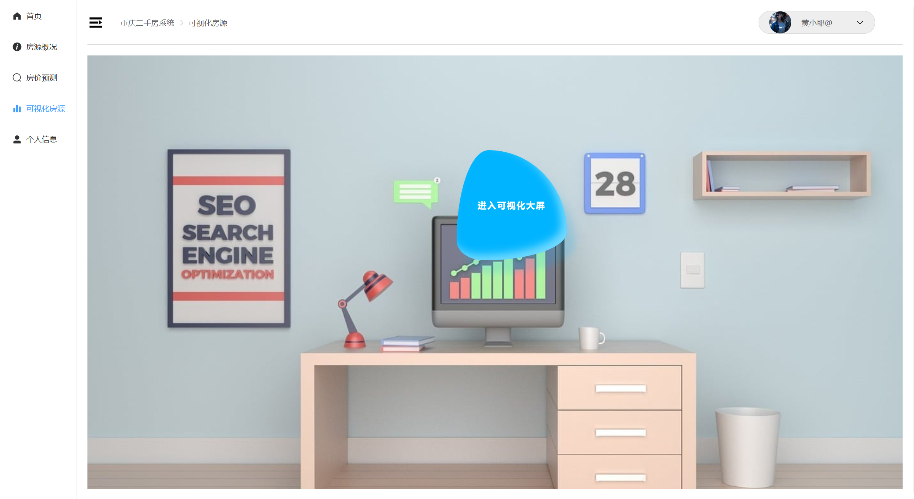
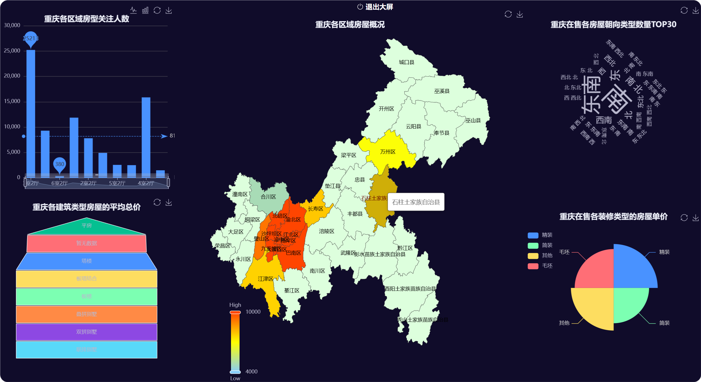
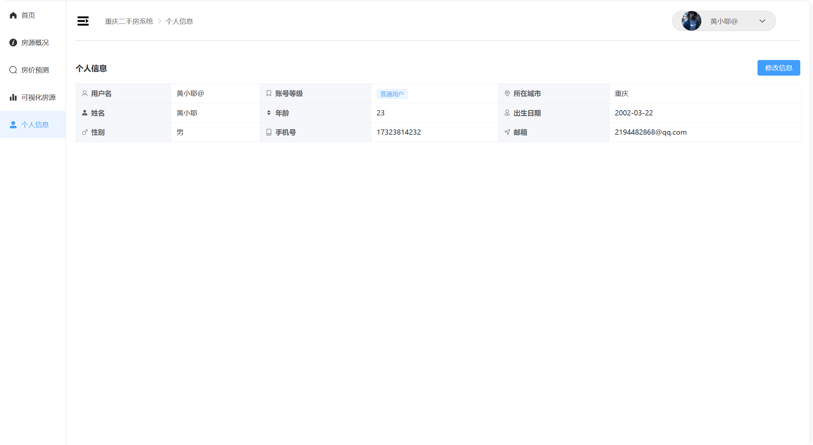

# 房源可视化系统(DRF+Vue3)

   ](https://img.shields.io/badge/Mysql-8.4-brightgreen)   


# 一、项目前言

该项目是基于DRF和Vue3实现的前后端分离的房源可视化系统,数据是爬取的链家的二手房源信息......

#### 1、项目源码地址

|        | 后端地址                                                     | 前端地址                                    |
| ------ | ------------------------------------------------------------ | ------------------------------------------- |
| github | https://github.com/huangxiaoye6/django-rest-framework-DRF--house- | https://github.com/huangxiaoye6/Vue3-house- |

#### 2、项目功能

- 用户注册：使用邮件验证码来实现用户注册
- 用户登录：使用Jwt实现用户信息传输和认证
- 房源查询：提供房源查询，可分区域进行查询
- 房源统计：统计房源的概况信息
- 房加预测：输入房源有关信息实现对房源的单价和总价进行预测
- 房源分析：分析房源的基础信息
- 可视化房源（大屏）：对房源进行大屏可视化
- 个人信息：实现对个人信息的查询和修改

#### 3、前端项目结构

```
├─public   # 用于存放静态资源
├─src  
│  ├─app.vue # Vue应用的根组件
│  ├─main.ts  # 项目的入口文件
│  ├─assets  # 用于存放静态资源
│  ├─components  # 封装的组件
│  ├─router # 路由目录
│  ├─store  # Vue的状态管理
│  ├─types  # 存放Ts的类型定义文件
│  ├─utils  # 工具目录
│  │	├──────ChongQing.ts  # 获取重庆地图的接口
│  │	├──────request.ts  # 封装axios请求文件
│  │
│  └─views  # 业务组件目录
│─static  # 用于存放静态资源
├── package.json        # 项目配置文件及依赖列表
├── package-lock.json    # npm生成的文件，用于锁定安装包的版本
├──tsconfig.json   # TypeScript配置文件  
├──vue.config.js   # Vue CLI的配置文件，用于覆盖默认配置
└─README.md  # 项目说明文件

```

# 二、项目配置到本地

#### 1、项目依赖配置

在终端下执行安装依赖

```
npm install
```

#### 2、项目运行

终端下执行

```
npm run dev
```

在终端里看到[http://localhost:5173/]()就说明前端配置成功了

# 三、项目效果演示

<center>
    
    
    
</center>


<center>
    
    
    
</center>

<center>
    
	
</center>


# 四、问题

如果项目有问题请在[这里](https://github.com/huangxiaoye6/django-rest-framework-DRF---house-/issues)点击提交，当然也可以发送到我的邮箱2194482868@qq.com,我将尽快为大家解答

# 致大家🙋‍♀️🙋‍♂️

如果本项目帮助到了你，请给项目加个[Star]()，让更多的人看到。 您的回复和支持将会是我继续更新维护下去的动力。


